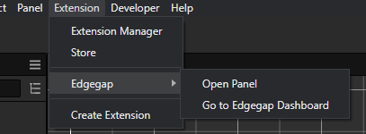
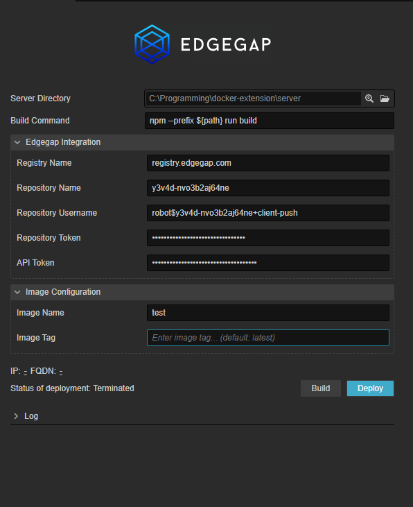
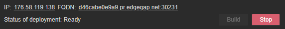
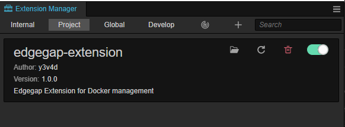

# Edgegap Extension
This version of Edgegap extension was created for the newest version of Cocos Creator (3.6.1) and it may have trouble working in the older version. It definitely won't work in the version before 3.x.

## Context Menu
Opening the panel, as well as opening the Edgegap Dashboard is done through the context menu that will be added to the **Extension** menu located at the top of the Cocos Creator editor.



## Panel
Settings panel is the heart of the extension. Building the server, deploying the image, creating application and deploying it is all done in this single panel. At the very bottom, it contains the log box, that will track and print all necessary messages that will appear during the build and deployment process.

### Appearance


### Funcionality
- **Server Directory** - Used to specify server directory that contains valid Dockerfile
- **Build Command** - Specifies command that will be used to build the server. The only available macro is `${path}` that will be replaced with the server directory path.
- **Registry Name** - Name of the Edgegap registry (for example: registry.edgegap.com)
- **Repository Name** - Name of the users container repository (for example: y3v4d-nvo3b2aj64ne)
- **Repository Username** - Users Edgegap container registry username. It's needed to successfully upload app version based on private registry image.
- **Repository Token** - Users Edgegap container registry token. It's needed to successfully upload app version based on private registry image.
- **API Token** - Users Edgegap API token. It's needed for Edgegap API calls.
- **Image Name** - Name of image that will be pushed (for example: test, my-image, linux-server...)
- **Image Tag** - Tag of the image that will be pushed (for example: 1.0, 1.1, 0.9...). When left empty, it will default to *latest*.

At the begging the panel also contains two buttons: **Build** and **Deploy**. After deployment the **Deploy** button will change to **Stop** button.



## Build Process
After clicking the **Build** button, the following steps will happen:

- Building the server specified in the **Server Directory** with command specified in **Build Command**. If it fails, the process will terminate.
- Building the Docker image based on a Dockerfile contained in the **Server Directory**. The image will have the following name: "**Registry name**/**Repository Name**/**Image Name**:**Image Tag**". If building the image fails, process will terminate.
- Next, the image validation starts. In this step, local container will be created for 2 seconds. If it doesn't exit, or exits without errors, the container is stopped and removed, and the building process proceeds. If it exists with code different then 0, the new container is removed (if exists), the newly created image is removed and the process terminates.
- After successful image validation, the image is pushed to the Edgegap Container Registry. If this step fails the process terminates.
- Next, the application is created. The application will be named as follows: "**Image Name**-app". If application already exists, the process will proceed to the next step. If creating the application fails from other reasons, the process is terminated.
- After creating the application, new version is created based on newly pushed image. New version will have unlocked 7777 TCP port with name default and will have the same name as the image tag. If version already exists, it will be patched. Patching application doesn't change it's ports, so if the ports need to change, the application version needs to be removed manually through the Edgegap Dashboard. If creating version fails from other reasons, the process terminates.
- If every step was successful, building exists without errors.

## Deployment
Deploying the application is done using the **Deploy** button, and stopping is done using the **Stop** button that will appear in place of **Deploy** button after deployment.

### Deploying the Application
Clicking the **Deploy** button will initiate the deployment process. Name of the app that will try to be deployed will be "**Image Name**-app" and the version of the app will be "**Image Tag**".

If deployment process fails because the app isn't created, or because it couldn't find a valid version, it will probably print the error in the log. If it fails from some other, internal reason (wrong ports, wrong repository credentials in the app version etc.) the status of the deployment will be **Error** and the actual error message has to be checked manually in the deployment section at the Edgegap Dashboard.

If deployment completed without errors, the deployment status will be **Ready** and FQDN and IP fields will contain valid endpoints of the deployment (FQDN will also have mapped port included). Successful deployment will also save the deployment ID to the extension settings, so exitting and opening the panel won't cause deployment to stop being tracked.

### Stopping The Deployment
After successful deployment, the whole panel will be blocked, and only the **Stop** button will be available. Clicking it will intiate the stop deployment process.

If it fails for whatever reason, it will stop tracking the deployment and unlock the panel.

## Server directory
Server used in the example project is very simple, it's a nodejs express project, that contains only one endpoint that prints the example message. Any server can be used in the extension, and the only requirement for it is to contain valid Dockerfile. Without it, the build process won't work.

## Installing the extension
To install the extension for other projects, just download the .zip package with built extension (without the *src* directory), and extract it in the *<project_root>/extensions/edgegap-extension* directory. Then reopen the Cocos Creator project and the extensions should be working. If not, go into the **Extensions Manager** in the **Extension** context menu at the top, go to the **Project** tab, and check if it's there, and if it's launched.



## Modifing the source code
In the included example project, the extension source code is availble under "*<project_root>/extensions/edgegap-extension/src*" path.

At the first launch of the example project, the extension isn't initialized and it won't work. To initialize it, go into the extension root directory in the terminal and launch `npm install`; it will install all necessary dependencies for the extension to work. 

This is not the case when installing the extension from the package without the source code, because it already has the *node_modules* folder packed.

### Files specification

#### **main.ts**
Entry point of the extension, it only contains message handlers for opening the panel, and opening the Edgegap Dashboard in the browser.

#### **shared/logger.ts**
This file only contains the definitions of the `Logger` class. `Logger` class is basically a wrapper that utilizes textbox, for easily adding and editing log messages.

#### **shared/utils.ts**
This file contains all funcions that are used to encapsulate common tasks in the extension. Functions like `callAPI` or `executeCommand` are further encapsulated in the latter files, and are not used in the main panel script itself. Here is also located the only global object in the extension, the `logger`, that is an object based on the `Logger` class.

#### **shared/commander.ts**
This file contains all CLI calls used in the extension. These are mostly various `docker` commands that are encapsulated for easier usage. All of the functions utilize `executeCommand` function from **shared/utils.ts** script.

#### **shared/api.ts**
In this file are encapsulated all used Edgegap API calls. All of the function utilize `callAPI` function from **shared/utils.ts** script.

#### **panels/default/index.ts**
The heart of the extension. This script is responsible for handling the logic of the extensions main panel, so it's the biggest script in the source code.
It's responsible for saving and loading the extensions configuration, assinging callbacks to the buttons, creating log entries, and handles logic for both build and deployment buttons.

The main thing that will be probably changed is the default ports for the new app version. Ports for the app are defined on 151 line of this script and it by default it looks like this:
```ts
ports: [
    {
        name: "default",
        port: 7777,
        protocol: "TCP"
    }
]
```
You can change the port number in the *port* field, and the protocol in the *protocol* field. Make sure to recompile the extension and remove the app version in the dashboard if it already exists, because updating the app version doesn't change it's ports.

### Building the extension
After changing anything in the source code, you have to rebuild it to see the changes. It is done by going into the extensions root directory in the terminal and launching `npm run build`.